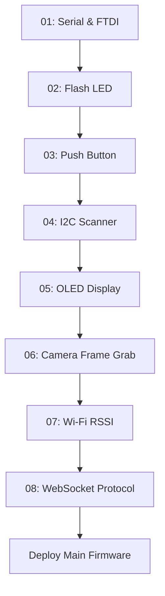

# Hardware Bring-up Guide (Staged Verification)

To avoid diagnosing simultaneous hardware, wiring, power, and RF issues, verify your prototype incrementally using the 8 staged sketches in `hardware/firmware/bringup/`.

---

## Bring-up Checklist Overview



---

## Stage 1: Serial & FTDI Link (`01_serial_test.ino`)
- **Objective**: Verify USB-UART link, power stability, baud rate (115200), and chip revision.
- **Wiring**:
  - FTDI TX -> ESP32 U0R
  - FTDI RX -> ESP32 U0T
  - FTDI GND -> Breadboard Common GND
  - Power: 5V 2A external supply to ESP32 5V and GND.
  - GPIO0 -> GND (only while flashing). Disconnect GPIO0 and press RST to run.
- **Pass criteria**: Serial Monitor displays chip info (ESP32-D0WDQ6, PSRAM enabled) and echoes typed characters.

---

## Stage 2: Flash LED (`02_flash_led.ino`)
- **Objective**: Test high-power flash LED on GPIO4.
- **Pass criteria**: White flash LED pulses 500ms ON / 2000ms OFF without causing brownout or reboot.

---

## Stage 3: Push Button & Debounce (`03_button_test.ino`)
- **Objective**: Test active-LOW push button on GPIO13 with 50ms software debounce.
- **Wiring**: Push button between GPIO13 and GND.
- **Pass criteria**: Each button press increments a counter cleanly over Serial with no bounce artifacts.

---

## Stage 4: I2C Bus Scanner (`04_i2c_scanner.ino`)
- **Objective**: Verify I2C communication on GPIO14 (SDA) and GPIO15 (SCL).
- **Pass criteria**: Serial output reports `I2C device found at address 0x3C` (SSD1306 OLED).

---

## Stage 5: OLED Display Test (`05_oled_display.ino`)
- **Objective**: Confirm graphic rendering and protocol state text on the 0.96" OLED.
- **Pass criteria**: Screen cycles through strings: `BOOTING...`, `READY`, `CAPTURING...`, `PROCESSING...`, `RESULT READY`.

---

## Stage 6: Camera Capture Test (`06_camera_test.ino`)
- **Objective**: Initialize OV2640 sensor and grab full SVGA (800x600) JPEG frames to PSRAM.
- **Pass criteria**: Serial logs report frame capture of ~25,000 to 50,000 bytes per frame in under 150ms.

---

## Stage 7: Wi-Fi Connectivity (`07_wifi_connection.ino`)
- **Objective**: Validate 2.4GHz Wi-Fi association and signal level.
- **Pass criteria**: Assigned DHCP IP address reported, and RSSI is greater than -75 dBm.

---

## Stage 8: WebSocket Protocol Client (`08_websocket_echo.ino`)
- **Objective**: Establish end-to-end authenticated connection to the FastAPI backend.
- **Pass criteria**: WebSocket handshake succeeds, `DEVICE_CONNECT` accepted, and status heartbeats are acknowledged.

---

## Full Firmware Deployment

Once Stages 1 through 8 pass individually:
1. Copy `config/wifi_secrets.h.example` to `config/wifi_secrets.h` and configure credentials.
2. Build and flash the complete firmware:
   ```bash
   pio run -t upload
   ```
3. Monitor live execution:
   ```bash
   pio device monitor -b 115200
   ```
