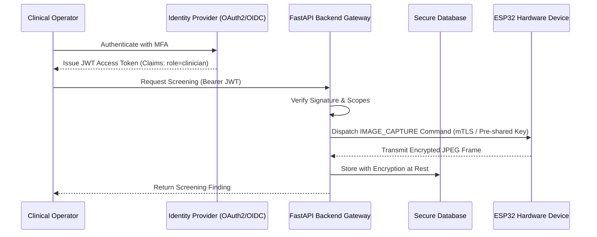

# Privacy, Data Governance & Security Architecture

This document formalizes the data governance, protection standards, and security roadmap for the AI Skin Screening IoT system.

---

## 1. Data Collected

The system processes minimal identifiable data strictly required for pre-clinical screening evaluation:

| Category | Specific Data Elements | Sensitivity |
|----------|------------------------|-------------|
| **Patient Identification** | Synthetic / Operator-entered display name, system-generated identifier (`PAT-XXX`) | High (Protected Health Info) |
| **Clinical Notes** | Optional operator notes regarding anatomical location or prior history | Medium |
| **Optical Images** | JPEG/PNG skin lesion photographs | High (Biometric/Medical) |
| **Screening Metrics** | Model prediction class, confidence score, optical quality scores (focus, exposure) | Medium |
| **Medicine Reminders** | Drug name, dosage instructions, schedule time, active status | Medium |
| **Device Telemetry** | ESP32 device ID, Wi-Fi RSSI, hardware state, timestamp | Low |

*Note: In development and benchmarking, strictly synthetic data (e.g. `DEMO-001`) must be used.*

---

## 2. Purpose of Processing

Data is processed solely for:
1. Conducting pre-clinical screening triages and research on edge-connected optical devices.
2. Allowing authorized operators to inspect longitudinal screening histories and compare lesion evolution over time.
3. Enabling operators to track scheduled medication regimens entered under clinical supervision.
4. Data is **never** shared with third-party tracking services or used for automated medical advertising.

---

## 3. Data Storage & Encryption

- **Database**: Metadata is persisted via SQLAlchemy in SQLite (development) or PostgreSQL (production).
- **Image Files**:
  - Raw images are saved into an isolated `data/uploads/` directory.
  - Files are renamed using cryptographic UUIDs (`<uuid4>.jpg`); client-provided filenames are completely discarded to prevent directory traversal and metadata leakage.
- **Encryption**:
  - *At rest*: In production, volume-level encryption (LUKS or AWS KMS / BitLocker) is required for database and upload volumes.
  - *In transit*: All HTTP/WebSocket communication must terminate behind TLS 1.3 reverse proxies.

---

## 4. Access Control & Authorization

- Device layer: Authenticated via high-entropy `DEVICE_TOKEN` shared secret via WebSocket handshake.
- Frontend layer: UI interacts through authorized API endpoints.
- Least Privilege: The ESP32-CAM firmware only receives short operational status strings on its OLED; **no patient names, IDs, or detailed diagnoses are ever transmitted to or displayed on the device**.

---

## 5. Retention & Deletion Policy

1. **Screening Images**: Retained for the duration of the evaluation session (default 30 days in research trials) unless explicit consent is logged for longitudinal study.
2. **De-identification**: Exported research records must strip patient names and retain only anonymized patient codes and normalized image hashes.
3. **Right to Erasure**: Deleting a patient record performs cascade deletion of all associated screening images, prediction records, and medicine reminders from disk and database.

---

## 6. Future Production Authentication Architecture

For clinical and commercial deployment, the system transitions from shared secrets to modern token-based identity federation:

### Key Production Requirements:
1. **OAuth2 / OpenID Connect (OIDC)**: Implementation of PKCE authorization code flow for frontend users.
2. **Role-Based Scopes**:
   - `scope:screening:read` - View screening histories and reports.
   - `scope:screening:write` - Initiate hardware captures and uploads.
   - `scope:patient:admin` - Create, edit, and delete patient records.
3. **Hardware Mutual TLS (mTLS)**: For device-to-backend links, embedding client certificates in the ESP32 secure element or encrypted flash partition.
